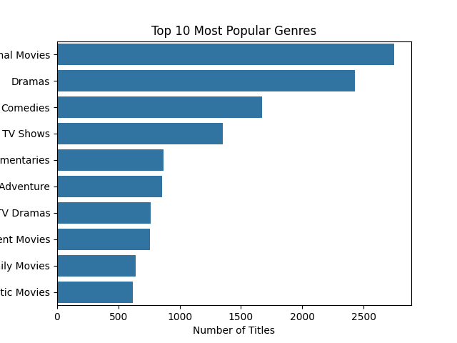
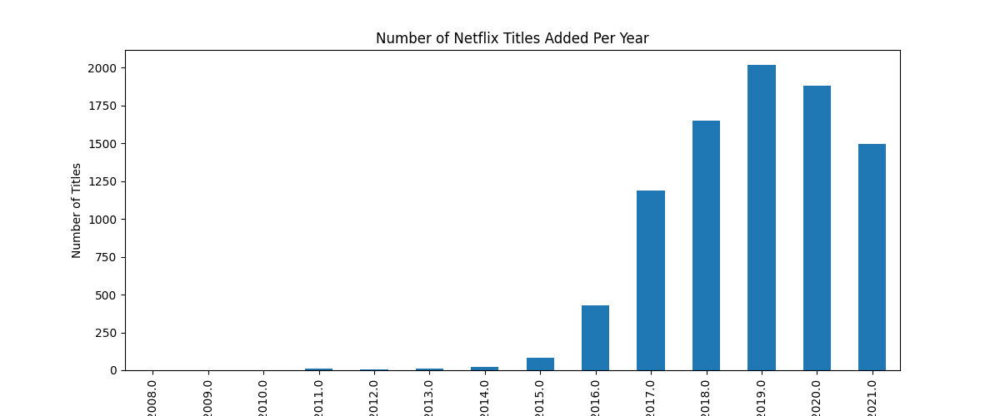
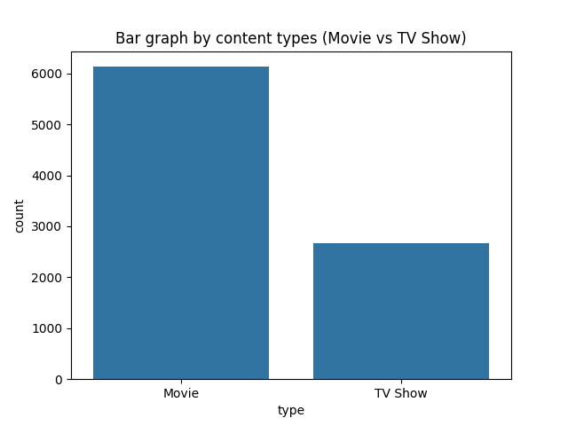

# 🎬 Netflix EDA: What’s Trending on Netflix?

This project explores the Netflix content catalog using exploratory data analysis (EDA).  
We aim to uncover trends in content type, release years, genres, and more.

---

## 📌 Dataset

- Source: [Kaggle - Netflix Movies and TV Shows](https://www.kaggle.com/datasets/shivamb/netflix-shows)
- Rows: ~8800 | Format: `.csv`
- Columns: `type`, `title`, `country`, `date_added`, `release_year`, `listed_in` (genres), etc.

---

## 🔍 Key Questions

- What types of content does Netflix offer more: Movies or TV Shows?
- Has the number of new additions increased in recent years?
- What are the most common genres on Netflix?

---

## 📈 Visual Insights  

### 1. Content Type Distribution

> Netflix offers more movies than TV shows — approximately 70% are movies.

---

### 2. Annual Content Additions

> There has been a sharp rise in content additions from 2016 to 2020, likely due to global expansion.

---

### 3. Most Popular Genres

> Top genres include Dramas, International Shows, Comedies, and Documentaries.

---

## 💡 Insights Summary

- **Movies dominate Netflix’s catalog**, but TV shows are increasing in recent years.
- **Content production exploded after 2016**, hinting at a platform expansion strategy.
- Netflix leans heavily on **international and drama genres** to serve global tastes.

---

## 🔧 Tools Used

- Python (Pandas, Matplotlib, Seaborn)
- Google Colab
- GitHub for version control and portfolio publishing

---

## 🙋‍♀️ About Me

Economics & Business undergraduate at Waseda University.  
Aspiring data analyst exploring media and consumer behavior through real-world data.  
Feel free to connect or check out my other projects!
